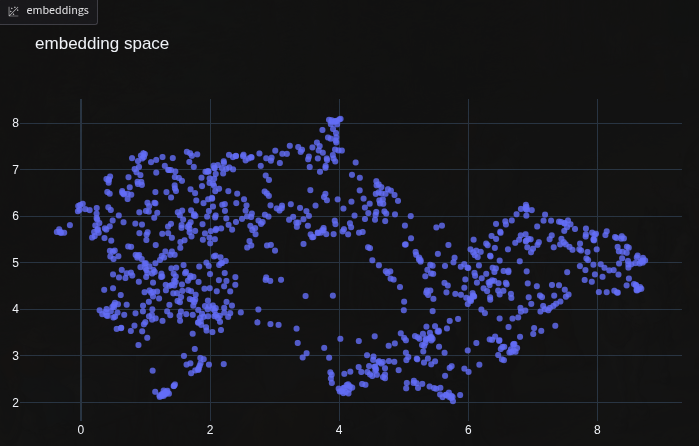

visual embeddings of multiples images in a scatter plot.
uses [facebookresearch/dinov2](https://arxiv.org/abs/2304.07193) for embeddings.

the input images are passed through the vision transformer to get semantic feature vectors(and are cached).

the embeddings are projected down to 2d coordinates using umap/tsne/pca. (choice can be done at the webapp as per number of images).

on the very first run, model weights are downloaded and dumped to cache. (current base model is ~4.5gbs, you can change it as per the comments on [embed.py](src/embed.py))

*visualization of embeddings:*



#### usage

```bash
git clone https://github.com/pandey-ps/space.git
cd space
uv run python src/app.py
```